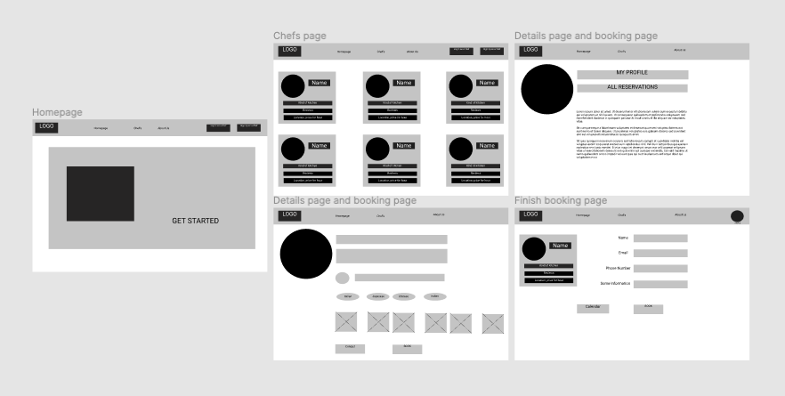
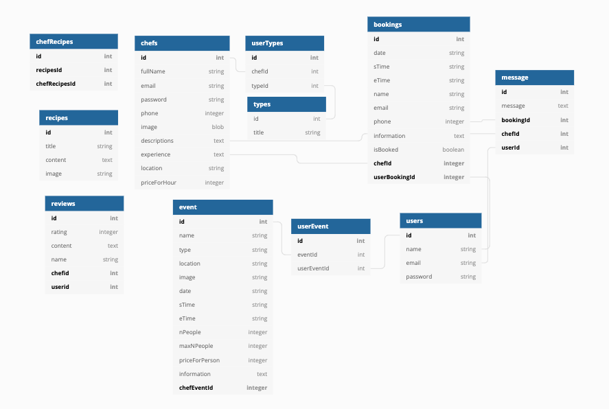
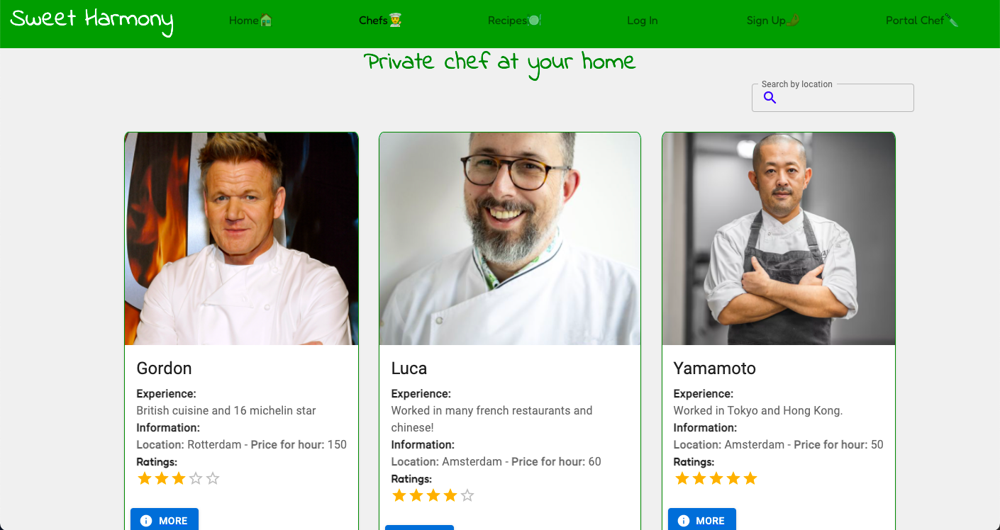
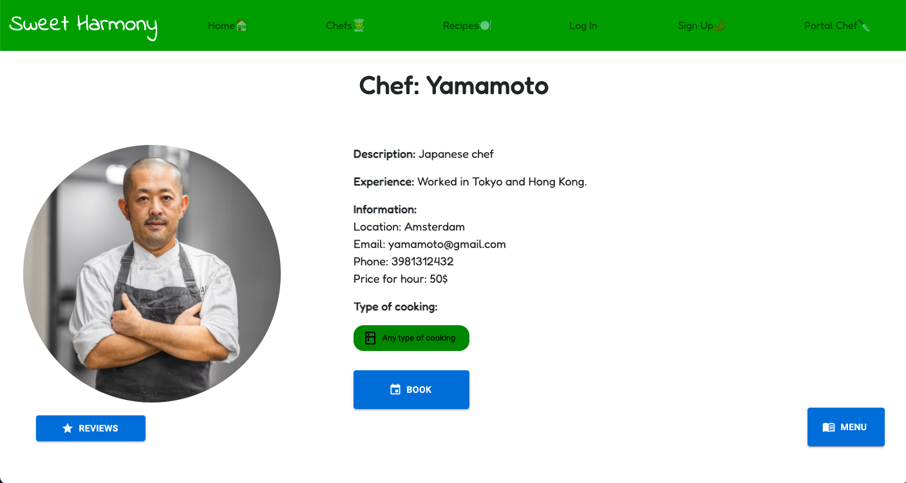
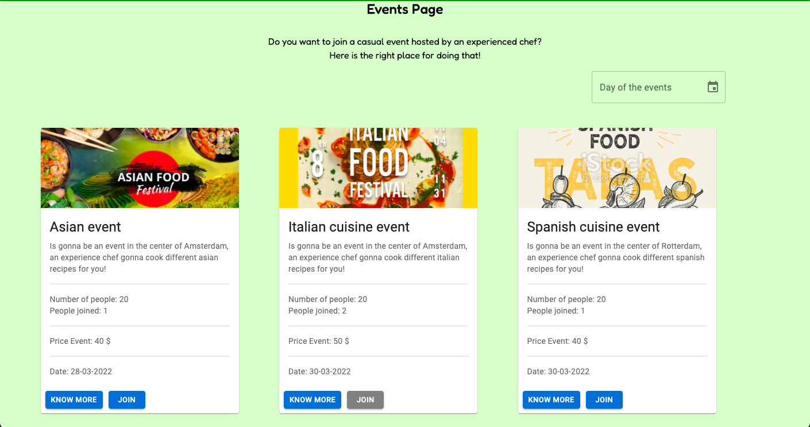
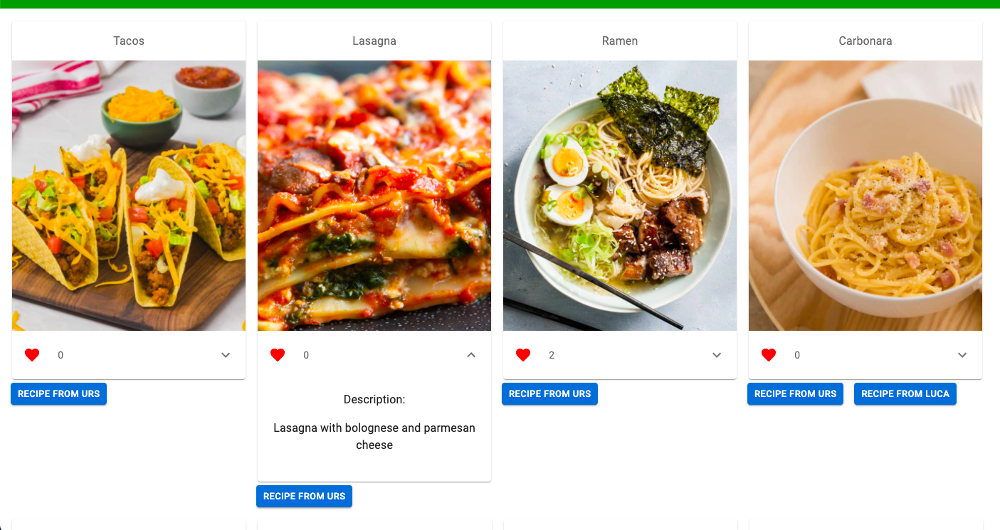

<h1>This app is a place where a user can enjoy his personal chef at home!</h1>
 

<strong>Problem: </strong> In corona time it was really difficult to enjoy an experience in a restaurant, and a lot of chef lost them job because of that. 
For this I create an app that resolve that problem, indeed with that you have the opportunity to book you personal chef at home and enjoy an amazing experience!

In only one week of Codaisseur Bootcamp I'm really happy on what I achieved for this Full-Stack App!

<h1>Wireframes:</h1>

  

<h1>Database Tables:</h1>

  

<h1>Database Repository:</h1>
https://github.com/FabioDiCeglie/Project-Sweet-Harmony-Deployed-Back-End

<h1>For this app I used:</h1>
 
Languages: Javascript
 
Frontend Libraries: React - Redux - Axios
 
Backend: Node - Express - Sequelize
 
Database: Postgres

    
  
  
  
  
  

<h1>Best Features:</h1>
 

 I'm absolutely happy about this two features:
 
1. Create a chat where a chef and user can speak about the booking!
 
2. Create an email service that also if I'm not a user I'm able to receive information about the booking with emails!

<h1>Website:</h1>
https://sweetharmony.netlify.app/
<h1>Login</h1>

 As a user: email: a@a.com pass: a. As a chef: email:gordon@gmail.com pass:gordon1234

 
<h1>Homepage</h1>

<h1>Detail page</h1>

<h1>Events page</h1>

<h1>Menu chef page</h1>

